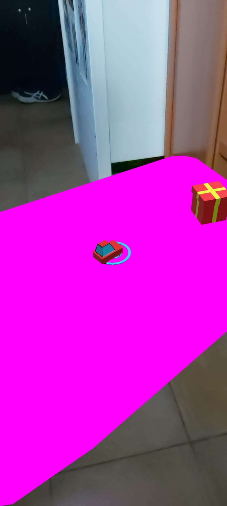
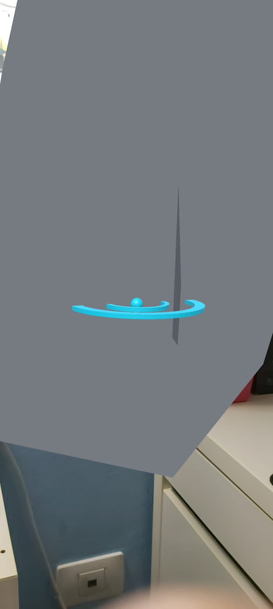

# unity-ar-foundation
- Por Pablo Santana González
## Parte 1. Tutorial.
Se ha seguido el tutorial proporcionado en el enunciado. Este es el resultado de probar la aplicación.

Se puede ver como el suelo es rosa. Esto se debe a que el material escogido para el plano es de ese color. Para los siguientes ejercicios los cambié a gris.
## Parte 2. Puntuación.
He añadido un canvas y un texto que aparecerá en la cámara del usuario. He etiquetado el texto como `points` para que cuando en el script `Car Behaviour` cuando detecta la colisión tome el objeto con su componente de puntuación (el script de puntuación) y llame a un método que cambie la puntuación final.
Código del script `Car Behaviour`:
```c#
    private void OnTriggerEnter(Collider other)
    {
        var Package = other.GetComponent<PackageBehaviour>();
        if (Package != null)
        {
            GameObject punctuation = GameObject.FindWithTag("points");
            punctuation.GetComponent<score>().UpdateScore();
            Destroy(other.gameObject);
        }
    }
```
Código del script `score`:
```c#
public class score : MonoBehaviour
{
    public uint points = 0;
    public void UpdateScore() {
        points++;
        GetComponent<TextMeshProUGUI>().text = "Puntuación: " + points.ToString();
    }
}
```

Se puede ver la puntuación en pantalla, pero desconozco de porqué el coche y el paquete dejan de aparecer. Como la modificación está hecha en el `OnTriggerEnter` del script que se le pone a todos los coches con el prefab de coche, debería funcionar la modificación y aumentar la puntuación al tocar un paquete.

## Parte 3. Vertical.
He modificado el componente `AR Plane Manager` del objeto `Driving Surface Manager` para que su propiedad `Detection Mode` fuera vertical en vez de horizontal.


Como se puede ver en las imágenes, los planos detectados son verticales (las paredes). No obstante, no aparece el vehículo en la pared, ni tampoco el paquete. La retícula aparece en horizontal.
